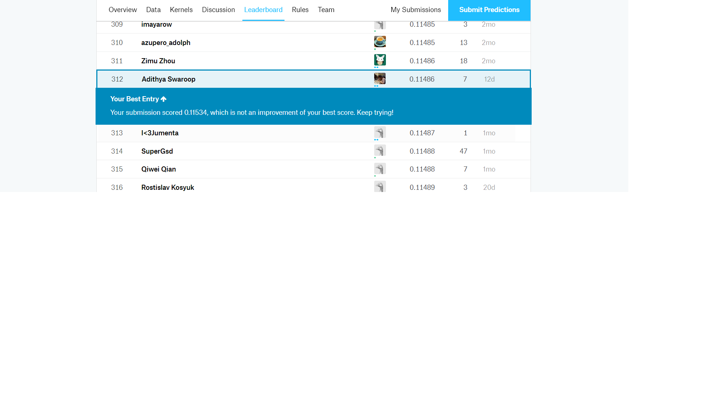

# Kaggle-House-Prices
This repo contains my solution for Kaggle Competition House Prices: Advanced Regression Techniques. It is actually adapted from a Top-Voted Kernel in Kaggle Competition page, and I improved the error by doing some extra feature engineering.

Right now (June 2019), my position is Top 7% (312/4659) and putting efforts to get into Top 3%. 

